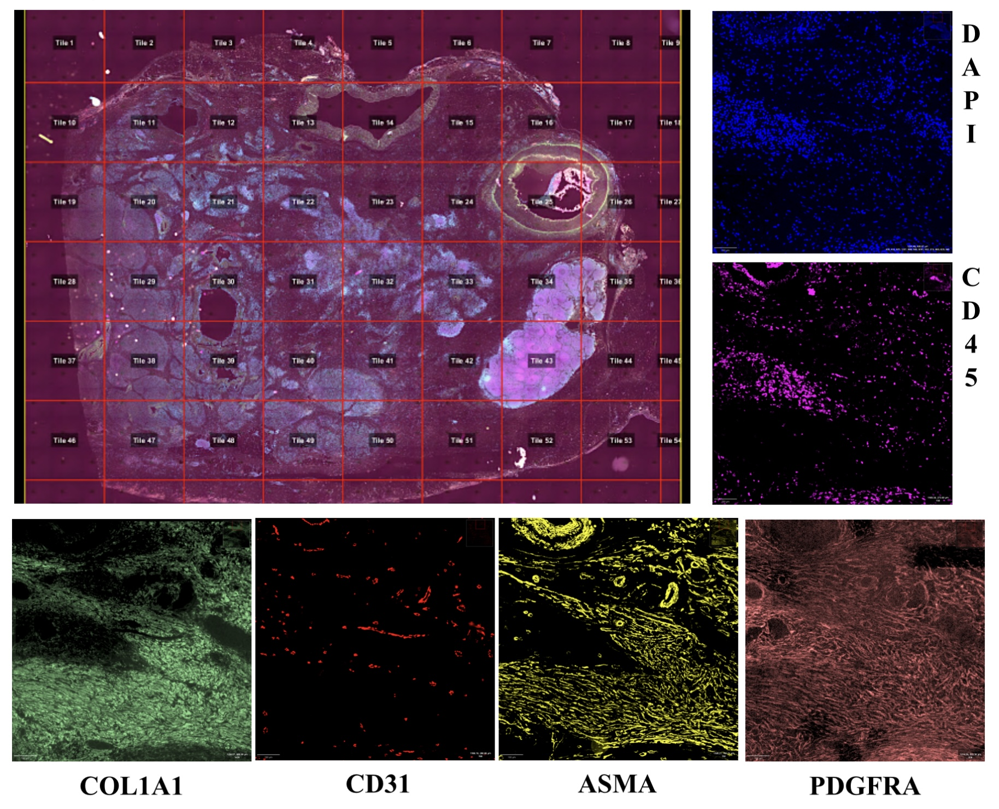

# IRIC-TrinhLab-Tools-MultiplexRegistration: Bioinformatic pipeline for cyclic multiplex imaging

Paper link : TBD

This is the official repository with the code and resources for our research project focused on generating a bioinformatic pipeline for cyclic multiplex imaging.

We dedicate to the open-source concept and wish the schoolers can be benefited from our release.

The trained models and the dataset are not available publicly due to the requirement of Centre Hospitalier de l'Université de Montréal (CHUM).

## Table of Contents
- [Overview](#introduction)
- [Project Structure](#project-structure)
- [Pipeline Technologies](#dependencies)
- [Usage](#usage)
- [Experimental Results](#experimental-results)
- [Contributing](#contributing)
- [License](#license)

## Overview
Multiplex imaging is a powerful technique for validating and discovering signaling pathways by highlighting 30-60 targets on the same tissue. However, this process is traditionally expensive and time-consuming, with proprietary reagents and software costs making it challenging to produce multiplex images consistently. 
*Cyclic Multiplex Imaging by Fluorescence (MxIF)* offers a cost-effective alternative that utilizes available equipment and open-source software. In this project, we aim to recreate the complete setup of multiplex imaging to support a 30-protein panel. 

## Project Structure
The project is structured as follows:

1. **CZI to TIFF Conversion Algorithm:** Conversion algorithm to transform CZI format images into TIFF format for further processing.

2. **DAPI-based Image Registration:** Image registration based on DAPI staining to align images properly.

3. **Tiling:** An automated Groovy script tiles the images into 4928 x 4928 pixel tiles, each representing the 31 targets of the multiplex.

4. **Channel Clearing:** Preprocessing step for clearing channels to enhance image quality.

5. **Re-tiling of 30 Protein+DAPI+RGB Layers:** Re-tiling and stacking of 30 protein channels, DAPI, and RGB layers into an easy-to-use ome.tiff format.

## Pipeline Technologies 
We've created a novel fully automated pipeline using the following technologies:

- **Python**: Shading correction using ZenBlue through Python scripting.
- **QuPath Scripting (Groovy)**: Tiling and cell segmentation.
- **ImageJ Macros (IJM)**: Image registration and stacking.
- **R**: Single-cell analysis (PCA, driver markers, cell population comparisons,statistical analysis for signal extraction).

## Installation
Before you begin, ensure you have met the following requirements:

- **Python 3.x:** Make sure you have Python 3.x installed. You can download it from [python.org](https://www.python.org/downloads/).
- **QuPath:** Install QuPath, an open-source digital pathology software, following the instructions provided on the [QuPath website](https://qupath.github.io/).
- **ImageJ/Fiji:** Install ImageJ/Fiji, an image processing software, by downloading it from the [ImageJ website](https://imagej.net/Downloads).
- **R:** Install R, a statistical computing environment, from [CRAN](https://cran.r-project.org/mirrors.html).

## Usage
Python, QuPath Scripting (Groovy), and ImageJ Macros (IJM) were used to create our novel fully automated pipeline. The process consists of shading correction using ZenBlue through Python scripting, Qupath tiling through Groovy Scripting, Image registration and image stacking in IJM.
Cell segmentation is performed in QuPath. Signal extraction is performed in QuPath. PCA and statistics are run in R.

## Experimental Results 
With our automated pipeline, we successfully processed 70 samples in just 14 days at a cost of $280 per sample.
This represents a significant cost and time reduction compared to traditional multiplex imaging methods.

Example of output from the multiplex from a 30 marker protein panel by immunofluorescence. An automated Groovy script tiles the images into 4928 x 4928 pixel tiles. Each tile represents the 31 targets of the multiplex panel:

Example of a tile registered and multiplexed:

## Contributing 

## License

This project is licensed under the MIT License. See the [LICENSE](LICENSE) file for details.

Copyright (c) [2023] [Melisa Farias Gonzalez] [Zean Ghanmeh]

Permission is hereby granted, free of charge, to any person obtaining a copy
of this software and associated documentation files (the "Software"), to deal
in the Software without restriction, including without limitation the rights
to use, copy, modify, merge, publish, distribute, sublicense, and/or sell
copies of the Software, and to permit persons to whom the Software is
furnished to do so, subject to the following conditions:

The above copyright notice and this permission notice shall be included in all
copies or substantial portions of the Software.
